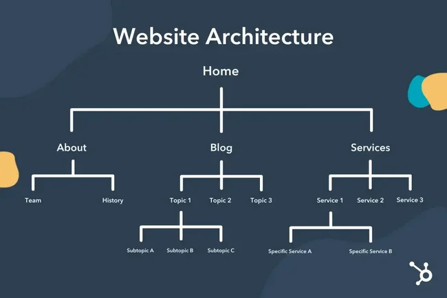

# what is website designing ?
1.website designing is creativity to create any website of webpages and home page.

2.website designing is used to design webpages using

**website designing used some markup language**

 i.html & html5
 ii.css * css3
iii.css preprocessor (sass)
 iv.framework (bootstrap)
  v.tailwind css
 vi.javascript & jquery special effects and advanced jquery
vii.live responsive projects

**website designing architectures**

https://53.fs1.hubspotusercontent-na1.net/hub/53/hubfs/website-architecture-example.webp?width=650&height=433&name=website-architecture-example.webp

